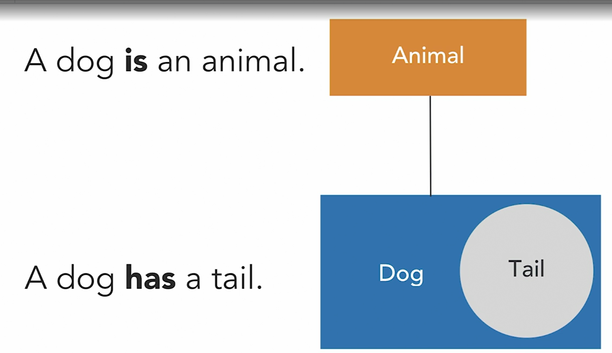
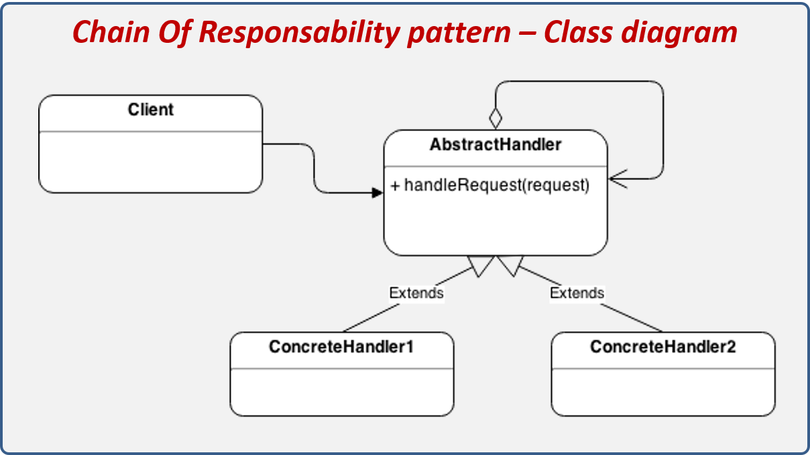
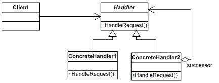

# Java Design patterns
# Java Design patterns : Behavioral part 1
[course](https://www.linkedin.com/learning/java-design-patterns-behavioral-part-1)

# Design pattern
code who solves one specific well known problem
- maintainable (because is standard)
- reusable (because is standard)

# Design pattern: when to use
it becomes important to know when to use and when not to use certain pattern

# Class pattern
is a
  

# Object pattern
has a

# Behavioral Design pattern
about composition (how they interact)

# Behavioral Class pattern
about inheritance

# Chain of responsibility : concept
you need to send a request, but you don't know who will execute that request
  
  

# Chain of responsibility : benefits
- passes the request until it is handled
- decouples sender from receiver

# Chain of responsibility : samples
- authentication handler
- http request handler

# Chain of responsibility : be aware of
- Circular chains
- not attended request
- stack trace

# Chain of responsibility : code : successor chain : document handler
  
```shell
docker run -it --rm openjdk:11 jshell
```
```java
public abstract class DocumentHandler {
  private DocumentHandler next;

  public DocumentHandler(DocumentHandler next) {
    this.next = next;
  }

  void openDocument(String fileExtension) {
    if(next != null) {
      next.openDocument(fileExtension);
    }
  }
}

public class SlideshowHandler extends DocumentHandler {
  public SlideshowHandler(DocumentHandler handler) {
    super(handler);
  }

  void openDocument(String fileExtension) {
    if(fileExtension.equals("ppt")) {
      System.out.println("Opening slideshow document");
    } else {
      super.openDocument(fileExtension);
    }
  }
}

public class SpreadsheetHandler extends DocumentHandler {
  public SpreadsheetHandler(DocumentHandler handler) {
    super(handler);
  }

  void openDocument(String fileExtension) {
    if(fileExtension.equals("xlsx")) {
      System.out.println("Opening spreadsheet document");
    } else {
      super.openDocument(fileExtension);
    }
  }
}

public class WordDocumentHandler extends DocumentHandler {
    public WordDocumentHandler(DocumentHandler handler){
        super(handler);
    }

    @Override
    void openDocument(String fileExtension){
        if(fileExtension.equals("doc")){
            System.out.println("handle by word");
        }else{
            super.openDocument(fileExtension);
        }
    }
}

public class TextDocumentHandler extends DocumentHandler {

  public TextDocumentHandler(DocumentHandler handler) {
    super(handler);
  }

  void openDocument(String fileExtension) {
    if(fileExtension.equals("txt")) {
      System.out.println("Opening text document");
    } else {
      super.openDocument(fileExtension);
    }
  }
}

DocumentHandler chain = new SlideshowHandler(
    new SpreadsheetHandler(
        new TextDocumentHandler(null)
    )
);
chain.openDocument("ppt");
chain.openDocument("txt");
chain.openDocument("doc"); // not handled

DocumentHandler chain = new SlideshowHandler(
    new WordDocumentHandler(
        new SpreadsheetHandler(
            new TextDocumentHandler(null)
        )
    )
);
chain.openDocument("doc");
```  

- if you don't pass one handler to the chain, some request wouldn't be handled
- abstract instead of interface is useful to implement the base behavior about going throw the chain

# Chain of responsibility : code : authentication request
```java
public abstract class AuthenticationHandler{
    private AuthenticationHandler next;
    
    public AuthenticationHandler(AuthenticationHandler next){
        this.next = next;
    }

    void authenticate(String authenticationType){
        if(next!=null){
            next.authenticate(authenticationType);
        }else{
           System.out.println("No authentication handler found for "+authenticationType);
        }
    }
}

public class BasicAuthenticationHandler extends AuthenticationHandler{
    public BasicAuthenticationHandler(AuthenticationHandler handler){
        super(handler);
    }

    @Override
    public void authenticate(String authenticationType){
        if("basic".equals(authenticationType)){
            System.out.println("BasicAuthenticationHandler type will handle it!!");
        }else{
            super.authenticate(authenticationType);
        }
    }
}

public class ClientCertificateAuthenticationHandler extends AuthenticationHandler{
    public ClientCertificateAuthenticationHandler(AuthenticationHandler handler){
        super(handler);
    }
    
    @Override
    public void authenticate(String authenticationType){
        if("client_certificate".equals(authenticationType)){
            System.out.println("ClientCertificateAuthenticationHandler type will handle it!!");
        }else{
            super.authenticate(authenticationType);
        }
    }
}

public class DigestAuthenticationHandler extends AuthenticationHandler{
    public DigestAuthenticationHandler(AuthenticationHandler handler){
        super(handler);
    }
    
    @Override
    public void authenticate(String authenticationType){
        if("digest".equals(authenticationType)){
            System.out.println("DigestAuthenticationHandler type will handle it!!");
        }else{
            super.authenticate(authenticationType);
        }
    }
}

class Client{
    void main(){
        AuthenticationHandler authenticator = 
            new BasicAuthenticationHandler(
                new ClientCertificateAuthenticationHandler(
                    new DigestAuthenticationHandler(null)
                )
            );
        authenticator.authenticate("basic");
        authenticator.authenticate("client_certificate");
        authenticator.authenticate("openid");
    }
}

new Client().main();
```